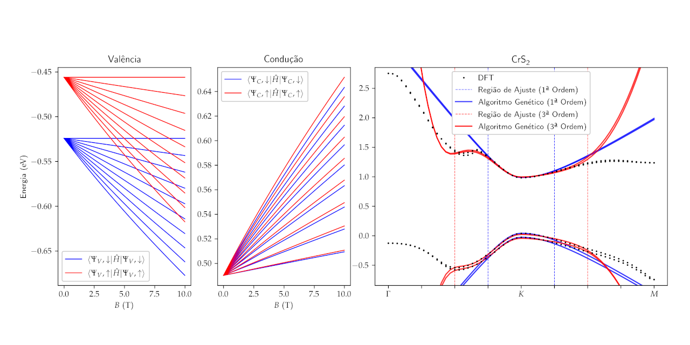

# Algoritmo Genético para o Ajuste das Bandas de Energia do CrS₂ e CrSe₂ via Modelo k·p

Trabalho de Conclusão de Curso apresentado em 23 de setembro de 2022 para a
obtenção do grau de Bacharel em Física pelo Instituto de Física da Universidade
de Brasília

## Resumo

Nas diversas áreas do conhecimento humano é bem conhecida uma série de problemas
de otimização. A solução desses problemas consiste em encontrar em um conjunto
de configurações, um subconjunto, ou mesmo um elemento que melhor satisfaça um
ou mais vínculos previamente determinados. Uma estratégia famosa por solucionar
problemas de tal classe de forma rápida e eficiente consiste no emprego dos algoritmos
genéticos. São assim chamados devido à forte inspiração em fenômenos da biologia
evolutiva — como mutação, recombinação (ou crossover) e seleção — na elaboração de
suas etapas de execução. Neste projeto de trabalho é proposto um algoritmo genético
para a otimização de funções reais, isto é, para a procura dos pontos nos quais a
função é máxima (ou mínima). Sua implementação é feita em Python com o uso da
biblioteca NumPy. O algoritmo foi aplicado na otimização de algumas funções de
exemplo e na busca de uma matriz Hamiltoniana do modelo k·p para o melhor ajuste
das bandas de energia de condução e de valência de alguns Dicalcogenetos de Metais
de Transição — CrS₂ e CrSe₂ — calculadas previamente via o método DFT. Por fim, é
feita uma discussão acerca dos resultados e da eficácia e performance do programa.

## Onde acessar

Leia o trabalho na integra neste [link](https://davifeliciano.github.io/tcc/main.pdf).
